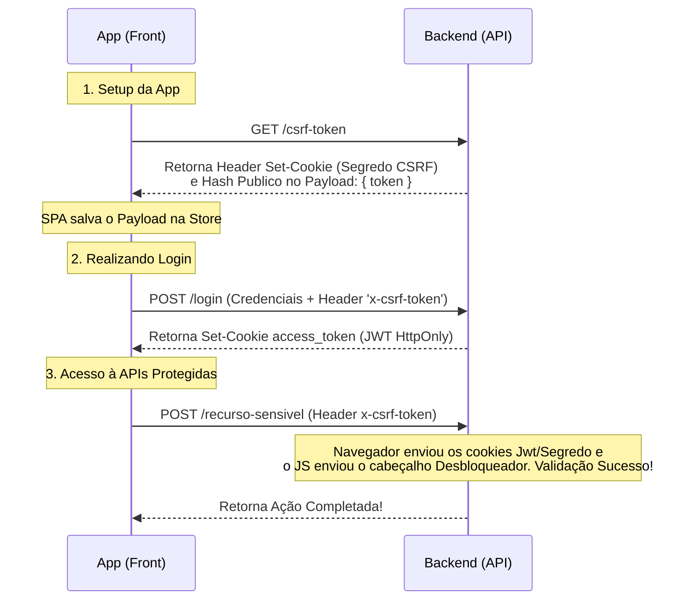

# Arquitetura de Autenticação Segura: JWT via Cookies HttpOnly & CSRF

Este documento resume as estratégias aplicadas no Backend para migração da gestão de tokens de acesso (previamente acoplados ao tráfego do payload e headers customizados) para o protocolo seguro gerenciado pelo navegador (Cookies HttpOnly com Proteção de Falsificação de Requisições). Após o resumo, o documento destrincha o roteiro técnico de implementação para o Frontend (SPA).

---

## 1. Resumo da Abordagem Backend

O aplicativo descartou a emissão de chaves sensíveis pelo Body (`{ "access_token": "..." }`) devido à vulnerabilidade de scripts nocivos roubarem dados do local-storage ou variáveis de escopo no navegador (XSS).

No lugar, injetamos duas camadas modernas de defesa em conjunto:

### Camada A: Autenticação Segura e Silenciosa (HttpOnly Cookie)
Sempre que um login obtém sucesso, o controlador backend intercepta a rede e aplica um cabeçalho `Set-Cookie`. Este cookie é selado com a flag `HttpOnly`, orientando que **nenhum JavaScript** na máquina do cliente tenha permissão para varrer ou ler esse cookie. Ele é transportado e lido organicamente pelo protocolo HTTP. 

### Camada B: Middleware contra Solicitações Forjadas (Anti-CSRF)
Ao blindarmos a leitura do token contra injeções XSS, abrimos vulnerabilidade nativa do formato de cookies ao formato "Cross-Site Request Forgery", onde abas maliciosas enviam formulários sem nosso conhecimento, que o nosso navegador assina sem questionar pois ele porta o _HttpOnly_ Cookie de sessão.

Para sanar isto implementamos o padrão **Double-Submit Cookie via csrf-csrf**:
- Uma rota não assinada `GET /csrf-token` inicializa a sessão real do usuário.
- Ela solta simultaneamente o `Segredo Criptográfico CSRF` (Em outro cookie inalcançável) e a `Chave Desbloqueadora` (na resposta legível). 
- Rotas nocivas/mutáveis (`POST`, `PUT`, `PATCH`, `DELETE`) no servidor recusam atendimento (Status 403) a menos que recebam no request Header a chave desbloqueadora original (`x-csrf-token`) emparelhada com o cookie secreto.

### Sincronismo da Vida Útil (Persistência)
Tanto o Cookie da Sessão Principal JWT quanto o Hash Secreto Anti-CSRF foram centralizados sob a constante `jwtConstants.expiresInMs`, ganhando sobrevida explícita e sobrevivendo a encerramentos/fechamentos brutos da janela do navegador, forçando um "Logoff Universal" estritamente após dar seu tempo legal (ex: 24h).

---

## 2. Fluxo Resumido



---

## 3. Guia de Implementação no Frontend (SPA)

Para que sua aplicação SPA (Angular, React, Vue, etc) transite por essa malha, ela precisa ser instruída a deixar o navegador trafegar cookies por baixo dos panos nas requisições cross-origin (CORS).

### Regra 1: Ativação de Credenciais Global
O cliente HTTP oficial da sua aplicação (ex: `axios`) deve ser sinalizado que irá trabalhar com credenciais. 

Se estiver utilizando `Axios`:
```javascript
import axios from 'axios';

const api = axios.create({
  baseURL: 'http://localhost:3000', // Sua URL real do Backend
  withCredentials: true, // IMPORTANTÍSSIMO: Permite troca de cookies HttpOnly CORS
});
```
Se estiver utilizando a API pura `fetch()` nativa do navegador:
```javascript
fetch('http://localhost:3000/rota', {
   // ...
   credentials: 'include' // O equivalente ao withCredentials do Axios
});
```

### Regra 2: Busca do Hasher CSRF na Inicialização do App
Seu arquivo raiz principal do front-end (`app.component.ts`,`App.tsx`, `main.js` ou equivalente de contexto central da aplicação) deve possuir um disparador no ciclo de vida de inicialização, cujo papel é acordar o servidor para que você consiga ler um token apto a habilitar as mutações:

```javascript
/* Função a ser rodada quando a página inteira ou plataforma carega a primeira vez */
async function bootAppHandshake() {
  try {
     const response = await api.get('/csrf-token');
     const csrfToken = response.data.token;
     
     // Guarde essa string preciosa no estado global de sua preferência 
     // (Zustand, Redux, Pinia, Context API, Service Root, etc).
     saveToStore('auth_csrf_token', csrfToken);
  } catch (error) {
     console.error('Falha ao obter credencial CSRF. Mutações POST falharão.');
  }
}
```

### Regra 3: O Interceptador Mágico para Mutações
O `x-csrf-token` só é exigido por rotas `POST, PUT, PATCH e DELETE`. Para você não ter que copiar e colar o Token na mão em todo o código em que for mandar formulário do SPA pro Back-end, configure um Request Interceptor no seu Axios:

```javascript
// Onde você declarou o axios instanciado
api.interceptors.request.use((config) => {
  // Buscamos o Hash recuperado ao iniciar do App
  const csrf = getFromStore('auth_csrf_token'); 
  
  const methodsThatRequiresCsrf = ['post', 'put', 'patch', 'delete'];
  
  if (csrf && methodsThatRequiresCsrf.includes(config.method.toLowerCase())) {
     // Pendura a chave destravadora no cabeçalho especifico esperado 
     config.headers['x-csrf-token'] = csrf;
  }
  
  // Detalhe: NÃO DEVE-SE MAIS COLOCAR `Authorization: Bearer + JWT` em canto NENHUM! 
  // Remova interceptadores de token Bearer velhos se existirem. O navegador lida com isso.
  
  return config;
});
```

### 4. Como Executar um Login e Navegar Naturalmente
O fluxo passa a ser mais natural durante as telas do sistema. Exemplo do que será escrito na função que o botão da "Tela de Entrar" executa:

```javascript
async function efetuarLogin(email, senha) {
    try {
        // Isso passará natural por causa do interceptador do Passo 3!
        const result = await api.post('/login', { email, senha });

        console.log("Sucesso Absoluto!");
        // PRONTO. Não há nada para salvar na máquina. O payload `{ message: '...'}` pode ser ignorado.
        // O Navegador magicamente recebeu e grampeou o JWT `access_token` e o Segredo do CSRF sem te contar.
        
        redirecionarParaHomeDoSistema();
    } catch(err) {
       console.error("Credenciais Falharam!");
    }
}
```

Daí em diante basta consumir endpoints restritos (`api.get('/users/profile')`) tranquilamente; O Back-End processa a autoria e te devolve o conteúdo autorizado.

### Conclusões Adicionais ao Frontend
1. **Tratamento Global de 401/403:** Mantenha um interceptor de REPOSTAS para escutar status HTTP`401` ou `403`. Caso eles ocorram de surpresa pelo sistema (Ex: Passou de 24 horas transcorridas de navegação), acione de forma forçada uma deleção do token CSRF do seu Javascript e direcione a janela pro Login de aviso para renovar o tráfego de sessão.
2. **Ao deslogar:** Consuma a rota segura `await api.post('/logout')` antes de direcionar o roteador nativo pro login. Isso avisa ao backend para envenenar o cookie limpo para o navegador explodir o token de acesso antigo de vez do usuário.

---

## 5. Como Testar as Rotas Pelo Swagger

Para desenvolvedores e QA testarem diretamente as rotas restritas (incluindo mutações) usando o painel do Swagger UI, o fluxo simplificado é este:

1. **Efetuar Login Invisivelmente:**
   - Execute o endpoint `POST /login` passando as suas credenciais no body.
   - Aguarde o Retorno `200`. Embora nenhum token volumoso seja impresso no corpo, de forma oculta, o seu *Navegador grampeou o Cookie HttpOnly de acesso* e cuidará dele silenciosamente.

2. **Geração e Captura da Chave CSRF:**
   - Abra a aba do endpoint `GET /csrf-token` e clique no famoso botão de teste em `Execute`.
   - O `Response body` na interface do Swagger despejará o Payload `{ "token": "X-Sua-Chave-Mágica-aqui-X" }`.
   - Selecione este Hash textual gerado e **copie-o**!

3. **Travar as Portas (Authorize):**
   - Suba inteiramente a documentação do Swagger até o cabeçalho superior e clique no cadeado verde: **`Authorize`**.
   - Note que o Swagger agora solicitará apenas sua **ApiKey** referenciada pela label `x-csrf-token`.
   - **Cole a string exata** que você copiou do passo de obtenção da Chave. Conclua clicando em `Authorize`/`Save`.

**Pronto!** Realizar um `POST` num recurso protegido agora funcionará lindamente: O Swagger fará sua mágica despachando o cabeçalho recém-colado enquanto a inteligência do navegador se encarrega de amarrar automaticamente o seu cookie daquele terminal.
